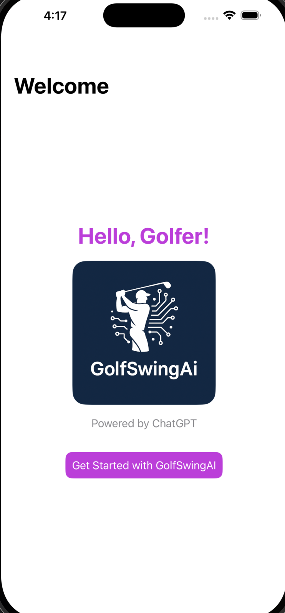
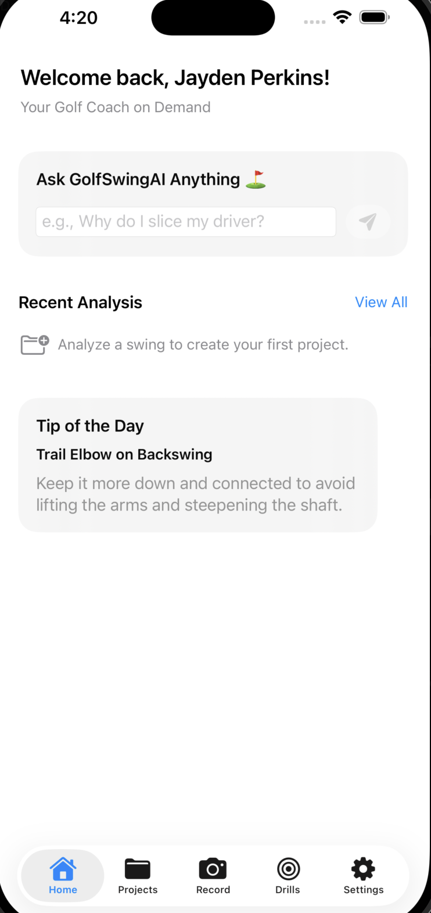
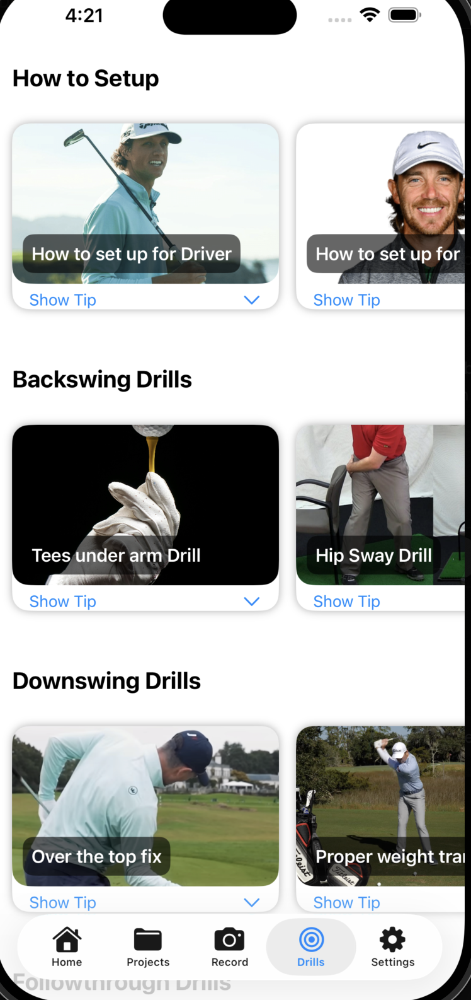

# Golf Swing Analyzer

A modern SwiftUI app for analyzing golf swings using AI and computer vision.

## Features

- Capture swing videos and label key stages (Setup, Backswing, Top of Swing, Downswing, Follow-through)
- Upload frames to an AI Coach for feedback and drills
- Save analyzed swings as projects for review
- Seamless, privacy-focused design; your swings stay on your device until you analyze

## Screenshots


*Login Page: Enter your name, email, and API key to get started.*


*Home Page: Dashboard with your golf swing projects and analysis.*


*Drills Page: Watch embedded video tips to improve your swing.*

<!-- Add more screenshots here if needed -->

## Getting Started

1. Clone this repo:
   ```sh
   git clone <repo-url>

