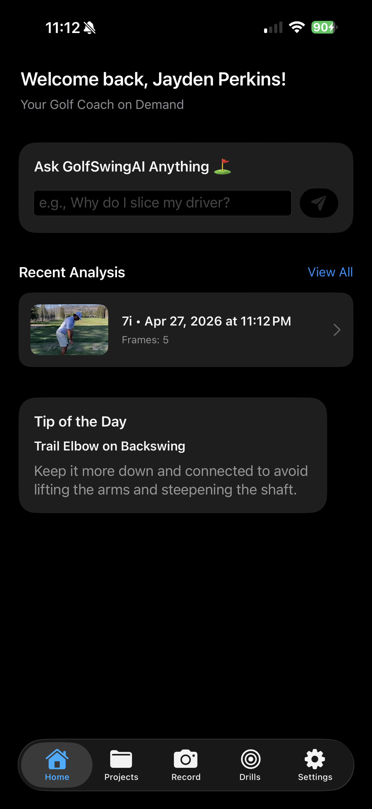
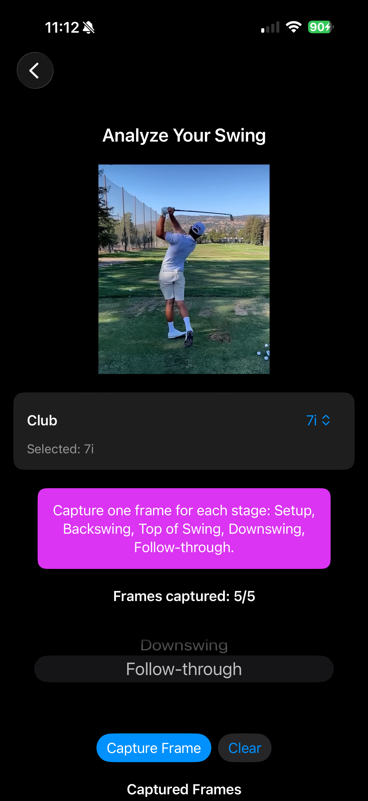
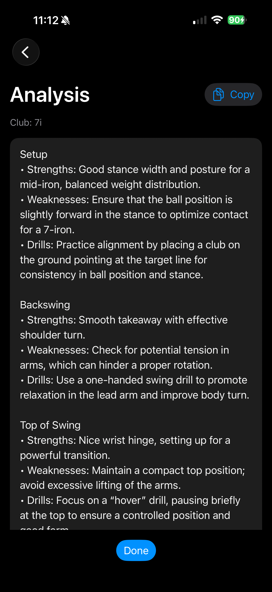
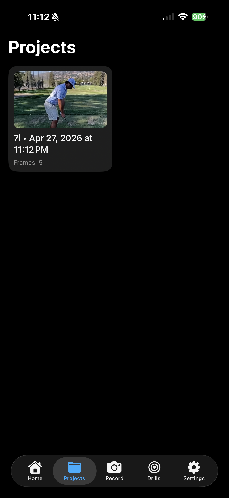

# Golf Swing Analyzer

A modern SwiftUI app for analyzing golf swings using AI and computer vision.

## Features

- Capture swing videos and label key stages (Setup, Backswing, Top of Swing, Downswing, Follow-through)
- Upload frames to an AI Coach for feedback and drills
- Save analyzed swings as projects for review
- Seamless, privacy-focused design; your swings stay on your device until you analyze

## Screenshots

*Home Page: Dashboard with your golf swing projects and analysis.*




*Frame Capture: Capture individual moments of your swing to be able to analyze it.*



<!-- Add more screenshots here if needed -->
*Feedback: Get a response from GolfSwingAi based on the frames you capturued and receive Feedback!*



*Projects: Go back and reference your previous analyzing sessions and see how you've grown!*



## Getting Started

1. Clone this repo:
   ```sh
   git clone <repo-url>
   
2. Install and open Xcode
   
3. Build and run


